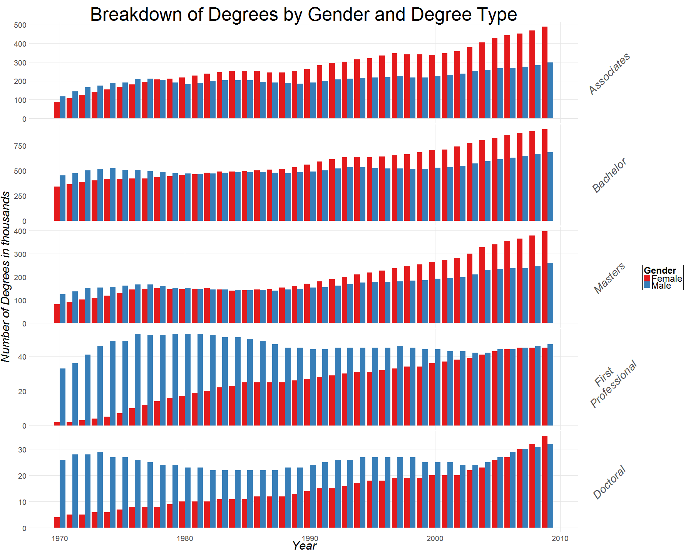
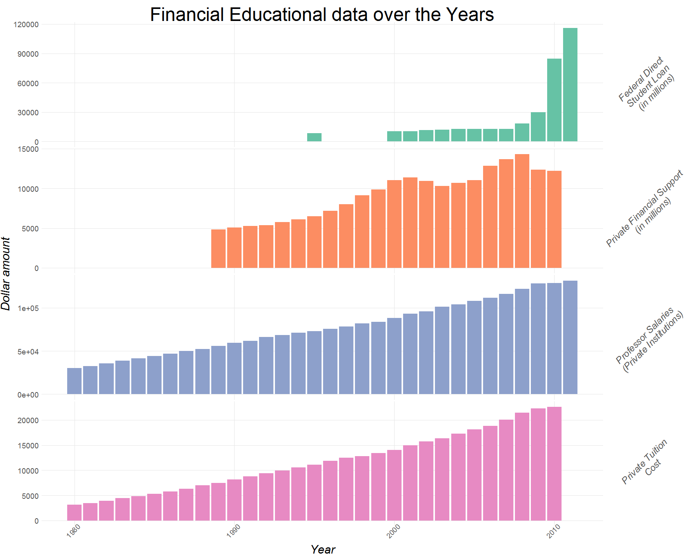

Rohan Fray IS608 Final
========================================================


```r
library("ggplot2")
library("reshape2")
library("stringr")
```


```r
Degrees.earned.by.Level.and.Sex <- read.csv("data/Degrees earned by Level and Sex.csv")
```


We melt Degrees.earned.by.Level.and.Sex by Year to get

```r
DegNorm = melt(Degrees.earned.by.Level.and.Sex, id.vars = "YearEnding")
DegNorm$value = as.numeric(gsub(",", "", DegNorm$value))
head(DegNorm)
```

```
##   YearEnding         variable value
## 1       1950 Alldegrees.Total   497
## 2       1960 Alldegrees.Total   477
## 3       1970 Alldegrees.Total  1271
## 4       1971 Alldegrees.Total  1393
## 5       1972 Alldegrees.Total  1508
## 6       1973 Alldegrees.Total  1587
```


We can then add another variable to the dataframe to tell us the difference between male and female

```r
DegNorm$MorF <- ifelse(grepl("Male", DegNorm$variable), "Male", (ifelse(grepl("Female", 
    DegNorm$variable), "Female", "NA")))
tail(DegNorm)
```

```
##     YearEnding        variable value   MorF
## 499       2004 Doctoral.Female    23 Female
## 500       2005 Doctoral.Female    26 Female
## 501       2006 Doctoral.Female    27 Female
## 502       2007 Doctoral.Female    30 Female
## 503       2008 Doctoral.Female    32 Female
## 504       2009 Doctoral.Female    35 Female
```


We then categorize the Degree Types

```r
DegNorm$variable = as.character(DegNorm$variable)
DegNorm$DegType = str_split_fixed(DegNorm$variable, "[.]", 2)[, 1]
DegNorm[which(DegNorm$DegType == "First"), ]$DegType = "First \nProfessional"
tail(DegNorm)
```

```
##     YearEnding        variable value   MorF  DegType
## 499       2004 Doctoral.Female    23 Female Doctoral
## 500       2005 Doctoral.Female    26 Female Doctoral
## 501       2006 Doctoral.Female    27 Female Doctoral
## 502       2007 Doctoral.Female    30 Female Doctoral
## 503       2008 Doctoral.Female    32 Female Doctoral
## 504       2009 Doctoral.Female    35 Female Doctoral
```


And then subset the data for only the five degree types and to take out the standalone years of 1950 and 1960

```r
DegNormSub = DegNorm[which(DegNorm$YearEnding > 1960 & DegNorm$DegType != "All" & 
    DegNorm$DegType != "Alldegrees"), ]
DegNormSub$DegType <- factor(DegNormSub$DegType, levels = c("Associates", "Bachelor", 
    "Masters", "First \nProfessional", "Doctoral"))
```


We are then ready for the first graph, detailing the breakdown of degrees by gender and degree type:
NB: that the scales are not the same for all the degree types

```r
a <- ggplot(DegNormSub, aes(x = YearEnding, y = value, group = MorF, fill = MorF)) + 
    geom_bar(position = "dodge", stat = "identity") + labs(x = "Year", y = "Number of Degrees in thousands", 
    title = "Breakdown of Degrees by Gender and Degree Type") + theme(plot.title = element_text(size = rel(4)), 
    legend.position = "right", legend.background = element_rect(color = "black"), 
    strip.text.y = element_text(color = "grey33", angle = 45, size = rel(3), 
        face = "italic"), strip.background = element_rect(color = "white", fill = "white"), 
    legend.text = element_text(size = rel(2)), legend.title = element_text(size = rel(2)), 
    axis.text.x = element_text(size = rel(2), color = "grey33", vjust = 1.5), 
    axis.text.y = element_text(size = rel(2), color = "grey33"), axis.title.x = element_text(size = rel(2.5), 
        face = "italic", vjust = 1), axis.title.y = element_text(size = rel(2.5), 
        face = "italic", vjust = 0.3))

b <- a + scale_fill_brewer(palette = "Set1", name = "Gender")

c <- b + facet_grid(DegType ~ ., scales = "free_y")

theme_update(axis.text.x = element_text(angle = 45, hjust = 1), panel.grid.major = element_line(colour = "grey90"), 
    panel.grid.minor = element_blank(), panel.background = element_blank(), 
    axis.ticks = element_blank(), legend.position = "none")

c
```

 

We see that as Female Degree holders are on a steady increase throughout the years for all degree types, for Males some degree types have either remained the same or have not grown as quickly as Females.


Now we take a look at some finances of higher education


```r
Federal.Student.Aid...Funds.Utilized.in.millions <- read.csv("data/Federal Student Aid - Funds Utilized in millions.csv", 
    na.strings = "", strip.white = TRUE)
Private.Tuition <- read.csv("data/Private-Tuition.csv", strip.white = TRUE)
Private.FinancialSupport <- read.csv("data/Private-FinancialSupport.csv", strip.white = TRUE)
Private.Salaries <- read.csv("data/Private-Salaries.csv", strip.white = TRUE)

# for simplicity, using private institution data

# first melt where needed and clean data as well as change column names in
# order to rbind later we also change all 4 dataframes to have three columns
# (Year, attribute, and value)
FedStudentAid = melt(Federal.Student.Aid...Funds.Utilized.in.millions, id.vars = "Type.of.assistance")
FedStudentAid$value = as.numeric(gsub(",", "", FedStudentAid$value))
FedStudentAid$variable = gsub("X", "", FedStudentAid$variable)
names(FedStudentAid)[names(FedStudentAid) == "variable"] <- "Year"
names(FedStudentAid)[names(FedStudentAid) == "Type.of.assistance"] <- "attribute"

PrivTuition = Private.Tuition
PrivTuition$Private.Tuition = as.numeric(gsub(",", "", PrivTuition$Private.Tuition))
PrivTuition$attribute = "Private Tuition"
names(PrivTuition)[names(PrivTuition) == "Private.Tuition"] <- "value"

PrivFinSupp = melt(Private.FinancialSupport, id.vars = "Item")
PrivFinSupp$value = as.numeric(gsub(",", "", PrivFinSupp$value))
PrivFinSupp$variable = gsub("X", "", PrivFinSupp$variable)
PrivFinSupp$Item = gsub("[..]", "", PrivFinSupp$Item)
names(PrivFinSupp)[names(PrivFinSupp) == "variable"] <- "Year"
names(PrivFinSupp)[names(PrivFinSupp) == "Item"] <- "attribute"

PrivSalaries = melt(Private.Salaries, id.vars = "TYPE.OF.CONTROL.AND.ACADEMIC.RANK")
PrivSalaries$value = as.numeric(gsub(",", "", PrivSalaries$value))
PrivSalaries$value = PrivSalaries$value * 1000  #as the salary is in thousands
PrivSalaries$variable = gsub("X", "", PrivSalaries$variable)
names(PrivSalaries)[names(PrivSalaries) == "variable"] <- "Year"
names(PrivSalaries)[names(PrivSalaries) == "TYPE.OF.CONTROL.AND.ACADEMIC.RANK"] <- "attribute"

# then we combine into one dataframe by year
data <- rbind(FedStudentAid, PrivTuition)
data <- rbind(data, PrivFinSupp)
data <- rbind(data, PrivSalaries)
```


```r
# We then take the subset of the data that we are interested in for the
# years 1980 onwards Federal Direct Student Loans (in millions of dollars)
# Private Tuition Salaries for Private School Professors Financial Support
# (in millions of dollars)
dsub <- data[which(data$attribute == "Federal Direct Student Loan (FDSL)" | 
    data$attribute == "Private Tuition" | data$attribute == "Private 4-year institutions" | 
    data$attribute == "Professor"), ]
dsub <- dsub[which(dsub$Year >= 1980), ]
dsub$Year <- as.integer(dsub$Year)
dsub$attribute <- as.character(dsub$attribute)
# we will rename our attributes and then factor and re-level to make
# plotting easier
dsub[which(dsub$attribute == "Private Tuition"), ]$attribute = "Private Tuition \nCost"
dsub[which(dsub$attribute == "Federal Direct Student Loan (FDSL)"), ]$attribute = "Federal Direct \nStudent Loan \n(in millions)"
dsub[which(dsub$attribute == "Private 4-year institutions"), ]$attribute = "Private Financial Support \n(in millions)"
dsub[which(dsub$attribute == "Professor"), ]$attribute = "Professor Salaries \n(Private Institutions)"
dsub$attribute <- factor(dsub$attribute, levels = c("Federal Direct \nStudent Loan \n(in millions)", 
    "Private Financial Support \n(in millions)", "Professor Salaries \n(Private Institutions)", 
    "Private Tuition \nCost"))
```


If we now wanted to take a look at 10 random samples of our dataset

```r
dsub[sample(nrow(dsub), 10), ]
```

```
##                                       attribute Year  value
## 133                      Private Tuition \nCost 1985   5315
## 146                      Private Tuition \nCost 1998  12801
## 157                      Private Tuition \nCost 2009  22299
## 128                      Private Tuition \nCost 1980   3130
## 174   Private Financial Support \n(in millions) 2004  10695
## 154                      Private Tuition \nCost 2006  18862
## 305 Professor Salaries \n(Private Institutions) 2011 131600
## 130                      Private Tuition \nCost 1982   3953
## 241 Professor Salaries \n(Private Institutions) 1995  73200
## 142                      Private Tuition \nCost 1994  10572
```


We are now ready for the graph that shows how salaries and tuition have been increasing, and the massive spike in Federal direct student loans.  Note that the scales are not the same.

```r
ggplot(dsub, aes(x = Year, y = value, fill = attribute)) + geom_bar(position = "dodge", 
    stat = "identity") + facet_grid(attribute ~ ., scales = "free_y") + labs(x = "Year", 
    y = "Dollar amount", title = "Financial Educational data over the Years") + 
    theme(plot.title = element_text(size = rel(4)), strip.text.y = element_text(color = "grey33", 
        angle = 45, size = rel(2.5), face = "italic"), strip.background = element_rect(color = "white", 
        fill = "white"), axis.text.x = element_text(size = rel(2), color = "grey33", 
        vjust = 1.5), axis.text.y = element_text(size = rel(2), color = "grey33"), 
        axis.title.x = element_text(size = rel(2.5), face = "italic", vjust = 1), 
        axis.title.y = element_text(size = rel(2.5), face = "italic", vjust = 0.3)) + 
    scale_fill_brewer(palette = "Set2")
```

 

